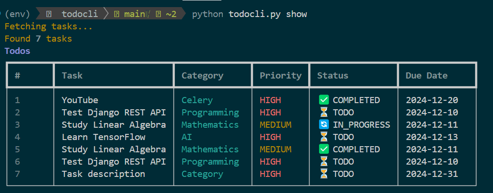
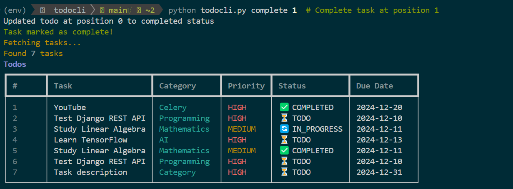
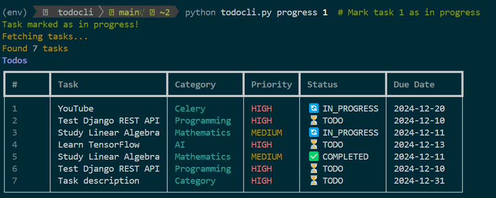
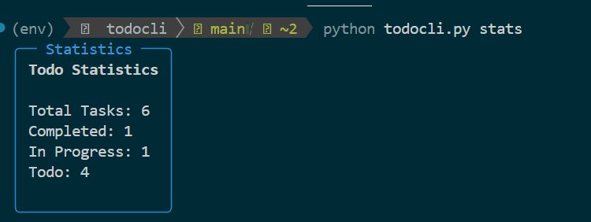

```markdown
# Task CLI - Python Task Management System

## Overview
A robust CLI task management system built by a Computer Science student focusing on Django, DevOps, and Data Science. This project demonstrates Python best practices and software architecture principles.


*Main interface showing task management capabilities*

## Quick Start
```bash
# Clone repository
git clone https://github.com/dhecaptain/task-cli.git
cd task-cli

# Set up virtual environment
python -m venv venv
source venv/bin/activate  # Windows: venv\Scripts\activate

# Install dependencies
pip install -r requirements.txt
```

## Core Features
1. 📌 Priority-based task management
2. 📂 Category organization
3. ⏰ Due date tracking
4. 🔄 Status workflow (Todo → In Progress → Completed)
5. 📊 Task analytics
6. 💾 SQLite persistence

## Code Structure

### 1. Models (`models.py`)
```python
# Core data structures and enums
from enum import Enum
from dataclasses import dataclass

class TodoStatus(Enum):
    TODO = 1
    IN_PROGRESS = 2
    COMPLETED = 3

class Priority(Enum):
    HIGH = 1
    MEDIUM = 2
    LOW = 3

@dataclass
class Todo:
    task: str
    category: str
    priority: Priority
    # ... other fields
```

### 2. Database Operations (`database.py`)
```python
# Database management and operations
class DatabaseConnection:
    def __init__(self, db_name='todos.db'):
        self.db_name = db_name

    # Context manager methods
    def __enter__(self):
        self.conn = sqlite3.connect(self.db_name)
        return self.conn

    def __exit__(self, exc_type, exc_val, exc_tb):
        self.conn.close()

# Core database operations
@safe_database_operation
def insert_todos(todo: Todo) -> bool:
    # Insert implementation

@safe_database_operation
def get_all_todos() -> List[Todo]:
    # Retrieval implementation

# ... other database operations
```

### 3. CLI Interface (`todocli.py`)
```python
# Command-line interface implementation
import typer
from rich.console import Console

app = typer.Typer()
console = Console()

@app.command()
def add(task: str, category: str, priority: int = 3):
    """Add a new task"""
    # Implementation

@app.command()
def show():
    """Display all tasks"""
    # Implementation

# ... other CLI commands
```

## Usage Examples

### 1. Task Management
```bash
# Add new task
python todocli.py add "Learn Django REST" "Programming" --priority 1 --due "2024-12-31"

# View tasks
python todocli.py show

# Complete task
python todocli.py complete 1
```


### 2. Task Progress
```bash
# Mark as in progress
python todocli.py progress 1
```


### 3. Task Analysis
```bash
# View statistics
python todocli.py stats
```


## Database Schema
```sql
CREATE TABLE todos (
    id INTEGER PRIMARY KEY AUTOINCREMENT,
    task TEXT NOT NULL,
    category TEXT NOT NULL,
    status INTEGER NOT NULL,
    priority INTEGER NOT NULL,
    -- Additional fields
    CONSTRAINT status_check CHECK (status IN (1,2,3)),
    CONSTRAINT priority_check CHECK (priority IN (1,2,3))
)
```

## Development Stack
- **Core**: Python 3.7+
- **CLI Framework**: Typer
- **UI Enhancement**: Rich
- **Database**: SQLite3
- **Version Control**: Git

## Learning Path Integration
This project aligns with my development journey:
- ✅ Python & Django fundamentals
- 🔄 Database design principles
- 📚 Clean code architecture
- 🎯 Moving towards DevOps & Data Science

## Future Enhancements
1. Django REST API integration
2. Docker containerization
3. Data analytics features
4. React frontend interface

## Author
Polycarp
- 🎓 Computer Science Student (3rd Year)
- 💻 Aspiring Django Developer → DevOps → Data Scientist
- 🔗 GitHub: [@dhecaptain](https://github.com/dhecaptain)

## Installation Requirements
```bash
# Core dependencies
pip install typer
pip install rich
pip install python-dateutil

# Development dependencies
pip install pytest
pip install black
```

## Contributing
1. Fork repository
2. Create feature branch
3. Commit changes
4. Push to branch
5. Create Pull Request

## License
MIT License - See LICENSE file
```
